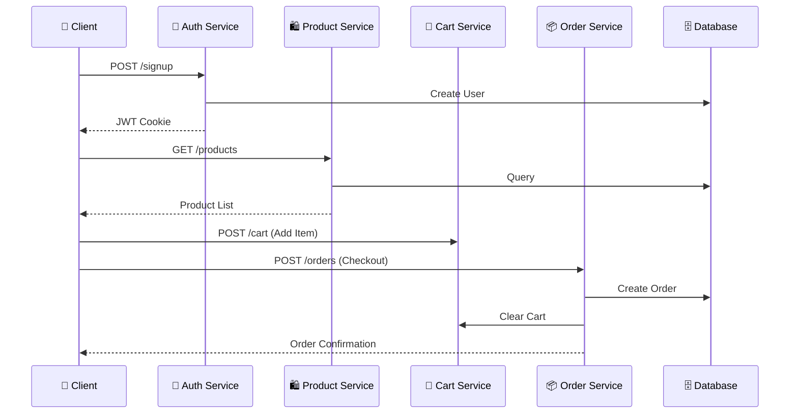

# Server Documentation

This directory contains the backend API for the E-Commerce platform. It is built using **Node.js** and **Express**, following a modular **MVC (Model-View-Controller)** architecture.

## 🚀 Tech Stack

- **Runtime:** Node.js
- **Framework:** Express.js
- **Database:** MongoDB (Mongoose)
- **Authentication:** JWT (JSON Web Tokens) & Bcrypt
- **Security:** Helmet, Rate Limiting, Mongo Sanitize, XSS Protection (HPP)
- **File Uploads:** Multer & Cloudinary
- **Documentation:** Swagger UI
- **Email:** Nodemailer

## �️ Project Structure

The server is organized into logical layers to ensure separation of concerns:

```
server/
├── controllers/        # Request handlers (Business Logic)
│   ├── authController.js
│   ├── productController.js
│   └── ...
│
├── models/             # Mongoose Schemas (Data Layer)
│   ├── UserModel.js
│   ├── ProductModel.js
│   └── ...
│
├── routers/            # API Route Definitions
│   ├── authRouter.js
│   ├── productRouter.js
│   └── ...
│
├── middlewares/        # Custom Middleware
│   ├── authMiddleware.js       # JWT verification & Role checks
│   ├── globalErrorController.js # Centralized error handling
│   └── uploadImagesMiddleware.js # File upload processing
│
├── utils/              # Helper Functions
│   ├── apiFeatures.js  # Pagination, Sorting, Filtering logic
│   ├── emailTemplates.js
│   └── appError.js     # Custom Error class
│
├── db/                 # Database Configuration
├── app.js              # Express App Setup (Middleware & Routes)
└── server.js           # Server Entry Point
```

## 🏗️ Architecture

### 1. MVC Pattern
- **Models**: Define the data structure and validation rules (e.g., `UserModel`, `ProductModel`).
- **Controllers**: Handle incoming requests, interact with models, and send responses.
- **Routers**: Map HTTP endpoints to specific controller functions.

### 2. Security & Middleware
The application implements a robust security layer:
- **Helmet**: Sets secure HTTP headers.
- **Rate Limiting**: Prevents brute-force attacks (100 requests/hour per IP).
- **Data Sanitization**: Protects against NoSQL injection (`express-mongo-sanitize`) and Parameter Pollution (`hpp`).
- **CORS**: Configured to allow requests from the client application.

### 3. Global Error Handling
A centralized error handling middleware (`globalErrorController.js`) catches operational and programming errors, returning consistent JSON error responses to the client.

### 4. Authentication & Authorization
- **JWT**: Access and Refresh tokens are used for session management.
- **Role-Based Access Control (RBAC)**: Middleware (`restrictTo`) ensures endpoints are protected based on user roles (`Customer`, `Seller`, `Admin`, `SuperAdmin`).

## � Key Features

### API Endpoints (Prefix: `/api/v1`)

- **Authentication**: Signup, Login, Password Reset, Token Refresh.
- **Products**: CRUD operations, Advanced Filtering, Searching, Pagination.
- **Orders**: Cart management, Checkout, Order History, Status Updates.
- **Admin Dashboard**: Dynamic CRUD for all system models (Users, Products, Categories).
- **File Uploads**: Image uploading to Cloudinary via Multer.

### 📜 API Documentation
Interactive API documentation is available via Swagger UI:
- **URL**: `http://localhost:8000/api-docs`

## 📦 Getting Started

### 1. Install Dependencies
```bash
npm install
```

### 2. Environment Setup
Create a `.env` file in the root of the `server/` directory with the following variables:

```env
PORT=8000
DATABASE_URL=mongodb+srv://<username>:<password>@cluster.mongodb.net/ecommerce
JWT_ACCESS_SECRET=your_access_secret
JWT_REFRESH_SECRET=your_refresh_secret
JWT_ACCESS_EXPIRES=15m
JWT_REFRESH_EXPIRES=7d
CLOUDINARY_CLOUD_NAME=your_cloud_name
CLOUDINARY_API_KEY=your_api_key
CLOUDINARY_API_SECRET=your_api_secret
EMAIL_USERNAME=your_email
EMAIL_PASSWORD=your_password
```

### 3. Run Server
```bash
# Development Mode (with Nodemon)
npm run server

# Production Mode
npm start
```

## � User Flow: From Signup to Order


