# Server Documentation

This directory contains the backend API for the E-Commerce platform. It is built using **Node.js** and **Express**, following a modular architecture.

## � User Flow: From Signup to Order

The following diagram illustrates the complete journey of a user interacting with the system, from creating an account to placing an order.

```mermaid
sequenceDiagram
    participant User as 👤 Client (User)
    participant Auth as 🔐 Auth Service
    participant Product as 🛍️ Product Service
    participant Cart as 🛒 Cart Service
    participant Order as 📦 Order Service
    participant DB as 🗄️ Database

    %% Signup / Login Flow
    Note over User, DB: 1. Authentication Phase
    User->>Auth: POST /signup (Details)
    Auth->>DB: Create User Record
    DB-->>Auth: Success
    Auth-->>User: Return 201 + Set JWT Cookie

    User->>Auth: POST /login (Credentials)
    Auth->>DB: Verify Password (Bcrypt)
    DB-->>Auth: User Valid
    Auth-->>User: Return 200 + Set JWT Cookie

    %% Browsing Flow
    Note over User, DB: 2. Browsing Phase
    User->>Product: GET /products
    Product->>DB: Query Products
    DB-->>Product: Product List
    Product-->>User: JSON Array of Products

    %% Cart Flow
    Note over User, DB: 3. Shopping Cart Phase
    User->>Cart: POST /cart (ProductId, Qty)
    Cart->>DB: Upsert Cart Item
    DB-->>Cart: Updated Cart
    Cart-->>User: Cart JSON

    %% Order Flow
    Note over User, DB: 4. Checkout Phase
    User->>Order: POST /orders (Cart Items, Address, Payment)
    Order->>DB: Save Order Record
    DB-->>Order: Order Created (ID: 123)
    Order->>Cart: DELETE /cart (Clear Items)
    Cart->>DB: Empty Cart
    Order-->>User: Order Confirmation (201 Created)

    %% Post-Order Flow
    Note over User, DB: 5. Post-Order Phase
    User->>Order: PATCH /orders/123/status (status: "Processing")
    Order->>DB: Update Status -> Paid/Processing
    Order-->>User: Status Updated
```



### 🛠️ Dynamic Admin Dashboard (SuperAdmin Only)

A powerful, dynamic administrative system has been implemented at `/api/v1/admin`. It allows for full CRUD operations across all models using a single set of generic routes, while enforcing strict field-level security.

- **Dynamic Resolution**: Models are resolved from the URL (e.g., `/admin/users`, `/admin/products`).
- **Security**: Restricted to `SuperAdmin` role only.
- **Field Awareness**: Each model has a whitelist of `createFields` and `updateFields` to prevent unauthorized modification of internal data.

#### Admin Endpoints:

- `GET /admin/:model`: List all records for any model.
- `GET /admin/:model/:id`: Get specific record.
- `POST /admin/:model`: Create new record (respecting allowed fields).
- `PATCH /admin/:model/:id`: Update record (respecting allowed fields).
- `DELETE /admin/:model/:id`: Delete record.

### Detailed Step-by-Step Flow

#### 1. Authentication

- **Action**: User submits registration form.
- **Endpoint**: `POST /api/v1/authentications/signup`
- **Backend**: Hashes password, saves user to MongoDB, generates JWT, and sets `httpOnly` cookie.

#### 2. Product Discovery

- **Action**: User views product listing.
- **Endpoint**: `GET /api/v1/products`
- **Backend**: Retrieves active products, applies pagination/filtering.

#### 3. Add to Cart

- **Action**: User clicks "Add to Cart".
- **Endpoint**: `POST /api/v1/cart`
- **Backend**: Finds user's cart (or creates one) and adds the item.

#### 4. Place Order

- **Action**: User proceeds to checkout and confirms payment.
- **Endpoint**: `POST /api/v1/orders`
- **Backend**:
  - Validates stock (optional step).
  - Creates a new `Order` document with status `Pending`.
  - **Crucial Step**: Clears the user's `Cart` in the database.
  - Returns the new Order ID.

#### 5. Payment & Delivery

- **Action**: User completes payment or Admin updates status.
- **Endpoint**: `PATCH /api/v1/orders/:id/status`
- **Backend**:
  - Updates `status` (Processing, Shipped, Delivered, Cancelled).
  - Handles logical transitions (e.g., sets `isPaid` on `Processing`, `isDelivered` on `Delivered`).
  - Enforces permissions (e.g., only Admin can ship/deliver, only owner can cancel).

---

## �📂 Folder Structure

The server is organized into the following directories:

- **`controllers/`**: Contains the business logic for each route.
  - `authController.js`: Authentication logic (signup, login, logout).
  - `productController.js`: Product management logic.
  - `orderController.js`: Order processing logic.
  - `handlerFactory.js`: Reusable CRUD handlers.
- **`models/`**: Mongoose schemas defining the data structure.
  - `UserModel.js`, `ProductModel.js`, `OrderModel.js`, etc.
- **`routers/`**: Express routers defining the API endpoints and mapping them to controllers.
- **`middlewares/`**: Custom middleware functions.
  - `authMiddleware.js`: Protects routes and restricts access based on roles.
  - `catchAsync.js`: Wrapper for handling async errors.
- **`utils/`**: Helper utility functions.
  - `appError.js`: Custom error class.
  - `sendResponse.js`: Standardized response formatter.
- **`db/`**: Database connection configuration.
- **`app.js`**: Express app configuration (middleware setup, route mounting).
- **`server.js`**: Server entry point (starts the server, connects to DB).

## 🔀 API Flow & Architecture

The server follows the **MVC (Model-View-Controller)** pattern (without the View, as it's an API).

1.  **Request**: Enters through `app.js`.
2.  **Security/Parsing**: Passes through global middleware (Helmet, CORS, Body Parser, Sanitization).
3.  **Router**: Routed to the appropriate `router` file (e.g., `orderRouter`).
4.  **Middleware**: Checked by `authMiddleware` (if protected) to verify JWT token and User Role.
5.  **Controller**: Reaches the `controller` which executes business logic.
6.  **Model**: Controller interacts with Mongoose `Models` to query/update the Database.
7.  **Response**: Controller sends a JSON response back to the client.

## 📡 API Endpoints (Base URL: `/api/v1`)

### 🔐 Authentication (`/authentications`)

- `POST /signup`: Register a new user.
- `POST /login`: Login and receive a JWT cookie.
- `GET /logout`: Logout user (clear cookie).

### 🛍️ Products (`/products`)

- `GET /`: Get all products (with filtering/pagination).
- `GET /:id`: Get single product details.
- `POST /`: Create a product (Seller/Admin).
- `PATCH /:id`: Update a product (Seller/Admin).
- `DELETE /:id`: Delete a product.

### 📦 Orders (`/orders`)

- `POST /`: Create a new order (Checkout).
- `GET /`: Get all orders (Admin).
- `GET /myorders`: Get logged-in user's orders.
- `GET /:id`: Get order details.
- `PATCH /:id/status`: Unified endpoint to manage order status (Processing, Shipped, Delivered, Cancelled).

### 🛒 Cart (`/cart`)

- `GET /`: Get user's cart.
- `POST /`: Add item to cart.
- `PATCH /`: Update item quantity.
- `DELETE /`: Remove item from cart.

### ❤️ Wishlist (`/wishlist`)

- `GET /`: Get user's wishlist.
- `POST /`: Add item to wishlist.
- `DELETE /:id`: Remove item from wishlist.

### 👤 Users (`/customers`, `/sellers`)

- `PATCH /customers/addresses`: Update customer address.
- `GET /sellers/profile`: Get seller profile.

### ⭐ Reviews (`/reviews`)

- `POST /`: Add a review for a product.
- `GET /`: Get reviews.

## 🛡️ Security Features

- **JWT Authentication:** Stateless authentication using JSON Web Tokens stored in HttpOnly cookies.
- **Role-Based Access:** Middleware (`restrictTo`) ensures only authorized roles (e.g., 'Admin', 'Seller') can access specific endpoints.
- **Input Sanitization:** `express-mongo-sanitize` prevents NoSQL injection.
- **Parameter Pollution:** `hpp` prevents HTTP Parameter Pollution.
- **Rate Limiting:** Limits the number of requests from a single IP.

## ⚠️ Error Handling

All errors are centralized in `globalErrorController.js`. The server returns standardized error responses:

```json
{
  "status": "error" | "fail",
  "message": "Error description"
}
```
